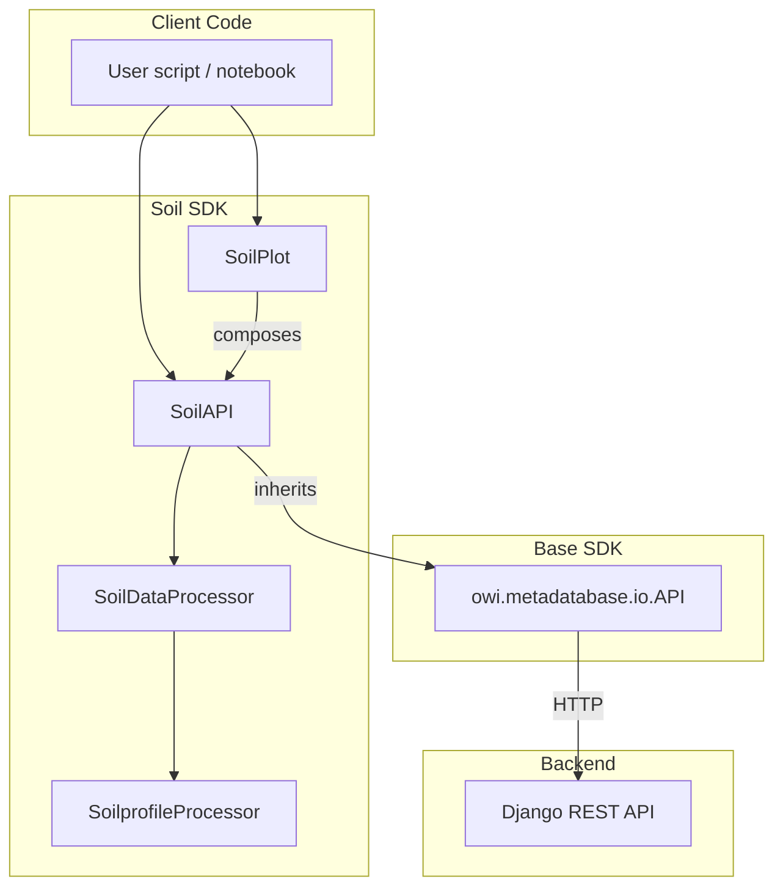

# Architecture

The Soil SDK follows a **three-layer architecture** that separates
network concerns from data transformation and visualisation.

## Layer Diagram

## SoilAPI — Network Layer

`SoilAPI` inherits from the base SDK's `API` class and appends
`/soildata/` to `api_root`. Every endpoint method:

1. Builds a URL path and query parameters.
2. Calls `self.process_data(url_data_type, url_params, mode)` from the
   base class (health check → request → JSON → DataFrame → postprocess).
3. Returns a typed dict: `{"data": DataFrame, "exists": bool, ...}`.

Proximity and closest-entity methods add a geographic filtering step
before returning results.

## SoilDataProcessor — Transformation Layer

A **static utility class** that never touches the network. It provides:

- **Coordinate transforms** (`transform_coord`) — EPSG:4326 → projected CRS.
- **DataFrame merging** (`combine_dfs`) — join raw + processed on `z [m]`.
- **Groundhog object construction** (`process_cpt`, `convert_to_profile`).
- **Batch loading** (`objects_to_list`) — georeference many profiles or CPTs.
- **Unit filtering** (`fulldata_processing`, `partialdata_processing`) —
  restrict test data to soil unit depth intervals.

## SoilprofileProcessor — SSI Input Validation

Validates soil profile DataFrames against method-specific column schemas
(API RP 2GEO, PISA) and adds derived columns like submerged unit weight
and elevation.

## SoilPlot — Visualisation Layer

Composes a `SoilAPI` instance and delegates to Groundhog/Plotly:

- **Test location maps** — scatter map on OpenStreetMap.
- **Profile fences** — lateral view along a transect.
- **CPT fences** — cone resistance profiles along a transect.
- **Combined fences** — overlaid profile + CPT data.
