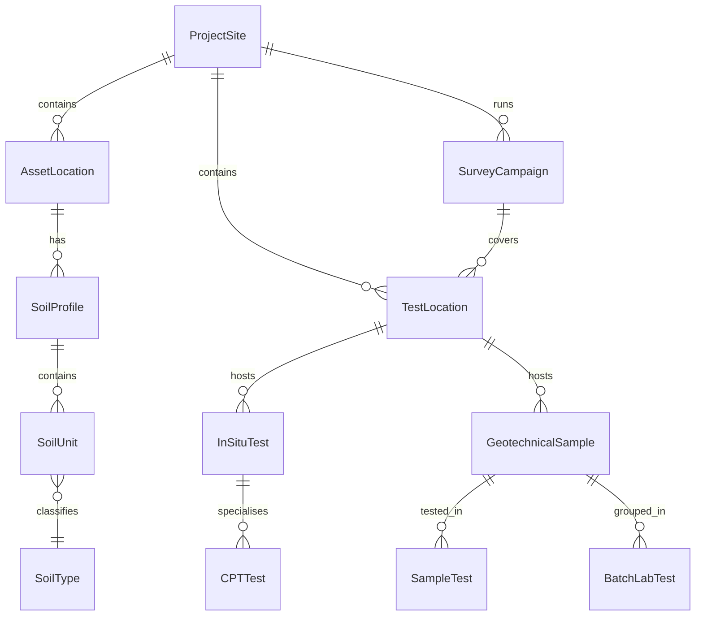
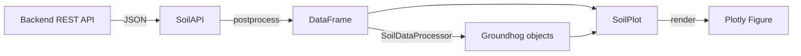

# Data Model

The soil backend schema centres on **test locations** that anchor all
in-situ tests, soil profiles, and laboratory data.

## Entity-Relationship Diagram

## Key Entities

### TestLocation

The geographic anchor for all field work. Identified by `title` within a
`ProjectSite`. Carries WGS-84 `latitude`/`longitude` coordinates.

### InSituTest

A field test performed at a test location (CPT, borehole, etc.).
The `testtype` discriminator determines which detail endpoint applies.

### CPTTest

Specialisation of `InSituTest` carrying raw and processed depth-series
DataFrames (`rawdata`, `processeddata`). Can be converted to a Groundhog
`PCPTProcessing` object.

### SoilProfile

An interpreted soil stratigraphy associated with an `AssetLocation`.
Contains ordered `SoilUnit` layers with depth ranges and geotechnical
properties.

### SoilUnit

A single layer within a profile, classified by `SoilType`. Properties
include total unit weight, undrained shear strength, friction angle,
relative density, G_max, and ε50.

### GeotechnicalSample / SampleTest / BatchLabTest

Laboratory entities linked to test locations. Used for parameter
characterisation and unit-level aggregation through
`SoilAPI.get_unit_sampletests()`.

### SurveyCampaign

Groups test locations into named campaigns (e.g. "2022 Q3 Geotechnical
Survey").

## Data Flow Through the SDK

