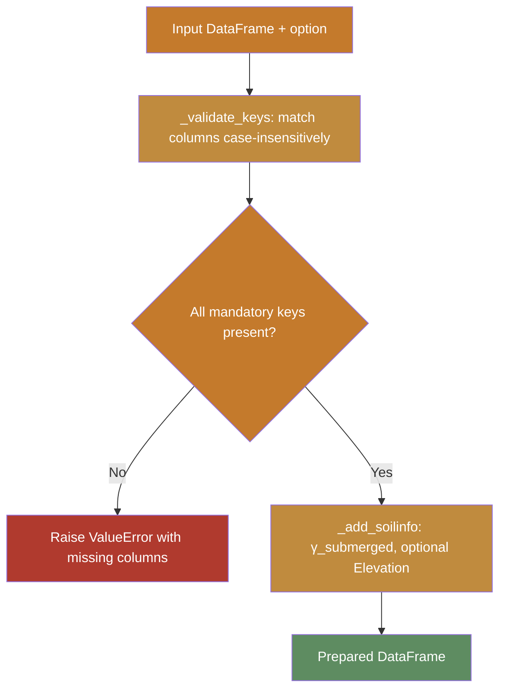

# SSI Workflows

The `SoilprofileProcessor` prepares soil profile DataFrames for
Soil-Structure Interaction analysis methods. This page explains the
validation logic and the supported method schemas.

## Supported Methods

| Key | Loading | Mandatory Columns | Optional |
|-----|---------|-------------------|----------|
| `apirp2geo` | Lateral | Depth from/to, Soil type, γ_total, Su, Φ, ε50 | Dr |
| `pisa` | Lateral | Depth from/to, Soil type, γ_total, Gmax, Su, Dr | — |
| `cpt` | Axial | *(reserved — not yet implemented)* | — |

## Validation Flow

## Column Matching

`_validate_keys` uses **case-insensitive fragment matching**: each key
in the schema is a tuple of substrings that must all appear in the column
name. For example, `("friction",)` matches `"Friction angle [deg]"`.

This allows flexible column naming in user-provided DataFrames while
still enforcing that the required geotechnical parameters are present.

## Derived Columns

`_add_soilinfo` computes:

- **γ_submerged**: `γ_total − γ_w` (where `γ_w = pw × 9.81`, default
  `pw = 1.025` for seawater).
- **Elevation [mLAT]** (optional): when a `mudline` value is provided,
  each depth row is annotated with its elevation relative to mLAT.
