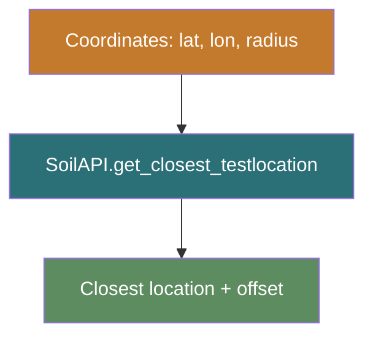
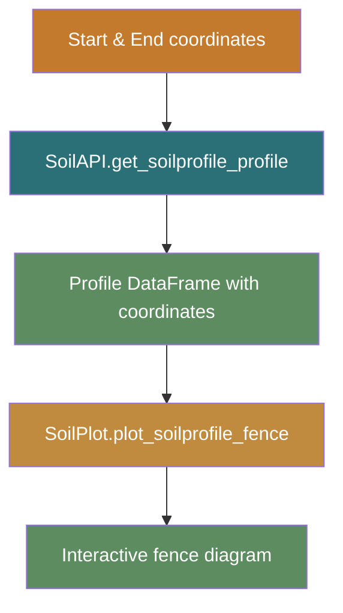
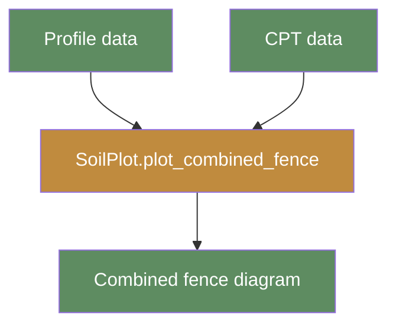

# Proximity Search & Fence Diagrams

!!! example
    This tutorial teaches you how to find the closest soil entities by
    geographic coordinates, build Groundhog objects from the results,
    and render profile and CPT fence diagrams interactively.

## Prerequisites

- Python 3.9+
- `owi-metadatabase-soil` installed
- A valid API token stored in a `.env` file
- Groundhog ≥ 0.10.0 (installed as a dependency)

## Mermaid Color Legend

The diagrams in this tutorial use a consistent visual language:

- <span style="color:#2B6F77">**Blue nodes**</span>: API calls, services, or external system interactions.
- <span style="color:#5E8C61">**Green nodes**</span>: Validated outputs, identifiers, or data frames.
- <span style="color:#C08B3E">**Amber nodes**</span>: Transformation, processing, or intermediate steps.
- <span style="color:#C47A2C">**Orange nodes**</span>: Decisions, parameters, or user inputs.

---

## Step 1 — Initialise the Client

```python
from owi.metadatabase.soil import SoilAPI, SoilPlot

api = SoilAPI(
    api_root="https://owimetadatabase-dev.azurewebsites.net/api/v1",
    token="your-api-token",
)
```

---

## Step 2 — Find the Closest Test Location

Use the 2-D proximity search to find soil entities near a target point:



```python
closest = api.get_closest_testlocation(
    latitude=51.707765,
    longitude=2.798876,
    radius=5.0,
)

print(closest["title"], f"— {closest['offset [m]']:.1f} m away")
```

The same pattern applies for every entity type:

| Method | Returns closest … |
|--------|-------------------|
| `get_closest_testlocation()` | Test location |
| `get_closest_insitutest()` | In-situ test |
| `get_closest_soilprofile()` | Soil profile |
| `get_closest_batchlabtest()` | Batch lab test |
| `get_closest_geotechnicalsample()` | Geotechnical sample |
| `get_closest_sampletest()` | Sample test |

---

## Step 3 — Retrieve Profile Data Along a Line



```python
start = (51.70, 2.79)
end = (51.72, 2.82)

profiles = api.get_soilprofile_profile(
    projectsite="Nobelwind",
    start=start,
    end=end,
    band=1000,  # 1 km corridor width
)
print(profiles["data"].head())
```

---

## Step 4 — Retrieve CPT Data Along the Same Line

```python
cpts = api.get_insitutests_profile(
    projectsite="Nobelwind",
    start=start,
    end=end,
    band=1000,
)
print(cpts["data"].head())
```

---

## Step 5 — Render a Soil Profile Fence Diagram

```python
plotter = SoilPlot(api)

fence = plotter.plot_soilprofile_fence(
    soilprofiles_df=profiles["data"],
    start=start,
    end=end,
    plotmap=True,
)
```

---

## Step 6 — Render a CPT Fence Diagram

```python
cpt_fence = plotter.plot_cpt_fence(
    cpt_df=cpts["data"],
    start=start,
    end=end,
    band=1000,
    scale_factor=10,
)
```

---

## Step 7 — Combined Profile + CPT Fence



```python
combined = SoilPlot.plot_combined_fence(
    profiles=profiles["data"],
    cpts=cpts["data"],
    startpoint=start,
    endpoint=end,
    band=1000,
    scale_factor=10,
)
```

## What You Learned

- How to use proximity searches to find the closest soil entities.
- How to retrieve profile and CPT data along a geographic transect.
- How to render fence diagrams with `SoilPlot`.
- How to combine profiles and CPTs in a single fence visualization.

## Next Steps

- [How-to: Build Soil Profiles](../how-to/build-profiles.md) — convert
  profile details into Groundhog `SoilProfile` objects.
- [Reference: Soil API](../reference/api/soil-api.md) — full auto-generated
  documentation for `SoilAPI`.
- [Explanation: Data Model](../explanation/data-model.md) — understand
  the entity relationships in the soil schema.
